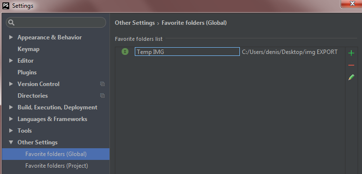
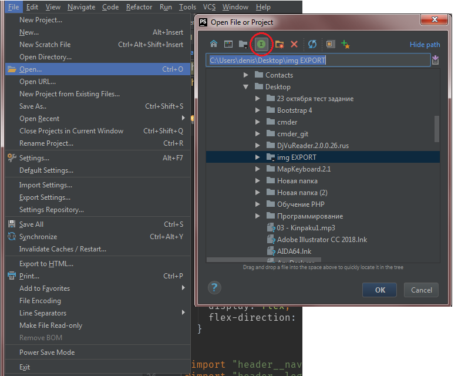

# PhpStorm (редактор кода от JetBrains)

---
## Полезные сочетания клавиш

* Ctrl + Shift + U -> Перевод выделенного текста в Uppercase или LowerCase
* Ctrl + Alt + J -> Наложение шаблона на выделенный участок кода `<tag>SELECT</tag>`

---
## Пользовательские настройки

* Settings -> Editor -> General -> Appearance : "Show whitespaces"=true

* Settings -> Editor -> General : "Use soft wraps in editor"=True

* Settings -> Keymap -> MainMenu -> File -> Synchronize -> Button2 Click (обновление папки проекта на колесо мышки)

* Settings -> Editor -> CodeStyle -> HTML|CSS|SCSS -> Tabs and Indents : TabSize=2, Indent=2, ContinIndent=8

* Settings -> Editor -> File and Code Templates -> CreateTemplate : NAME=Sass, Extension=scss, ReformatAccordingToStyle=true, code=
```js
.${NAME} {

}
```

* Settings -> Editor -> LiveTemplates -> ZenCSS -> Add : Abbreviation=@#, Description=prop_comments, ReformatAccordingToStyle=true, TemplateText="/* Positioning: posit..." (добавление быстрой команды для комментариев в CSS)

* Settings -> Editor -> LiveTemplates -> ZenHtml -> Add : Abbreviation=viewport, Description=meta-viewport, ReformatAccordingToStyle=true, TemplateText=
```html
<meta name="viewport" content="width=device-width">
```

* Setting -> Editor -> LiveTemplates -> ZenHtml -> Change : Abbreviation=!; Change meta tag ***viewport***
```html
<meta name="viewport" content="width=device-width, initial-scale=1, viewport-fit=cover">
```

---
## Список дополнительных плагинов

* EditorConfig
* FavoriteFolders

---
## Полезные плагины

* [FavoriteFolders](https://plugins.jetbrains.com/plugin/5940-favoritefolders) - Добавляет избранные папки в FileChooser окно
Настройка :

