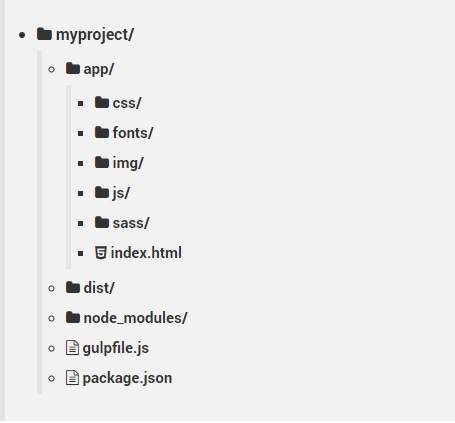

# Handbooks
Справочники по изучению web программирования.

* [Словарь терминов по front-end](src/termins.md)
* [Скорость загрузки сайтов Goodle](https://developers.google.com/speed/)

---
## Полезные ссылки

* [HTTP/1.1 Semantic and Content](https://tools.ietf.org/html/rfc7231#page-3)
* [BrowserSync](https://browsersync.io)

---
## Навигация по странице
* [Visually-hidden](https://github.com/deonisiu/Web-Handbooks#visually-hidden)

___
## Разделы

### Среда
* [PhpStorm 2017.1.4](src/PhpStorm/)
* [Sublime text 3](src/Sublime/)
* [Console, Bash, Vim](src/Console/)
* [Git, markdown](src/Git/)

---

### Основы
* [HTML](src/HTML/)
* [CSS](src/CSS/)
* [JavaScript](src/JavaScript/)
---

### Технологии
* [БЭМ методология](src/BEM/)
* [Bootstrap](src/Bootstrap/)
* [Sass/scss](src/Sass/)
* [PostCSS](src/PostCSS/)
* [SourceMaps](src/SourceMaps/)
---

### Автоматизация
* [NPM](src/Npm/)
* [Gulp](src/Gulp/)
* [Bower(deprecated)](src/Bower/)
* [EditorConfig](src/EditorConfig/)

### Unsorted
* [HTTP-REST - пустой](src/HTTP-REST/)
* [CDN - пустой](src/CDN/)

---
## Дополнительные инструменты

* [notepad++](src/notepad++/)

---
## Общая структура проекта



---
## Visually hidden
```css
.visually-hidden:not(:focus):not(:active),
input[type="checkbox"].visually-hidden,
input[type="radio"].visually-hidden {
	position: absolute;

	width: 1px;
	height: 1px;
    /* Похоже, никто до конца не понимает, почему тут margin: -1px. Кроме того, это приводит к проблемам (читай: https://github.com/h5bp/html5-boilerplate/issues/1985). */
	margin: -1px;
	border: 0;
	padding: 0;

	white-space: nowrap;

	/* Вырезаем ту часть контента, которая должна отображаться. */
  	/* Устаревшее свойство clip для старых браузеров */
	clip: rect(0 0 0 0);
  	/* clip-path для новых браузеров. inset(100%) определяет область вставки, которая позволит контенту исчезнуть.  */
  	clip-path: inset(100%);
    /* Скрываем вылезающий за границы контент */
	overflow: hidden;
}
```

---
## Семантическое Версионирование 
Учитывая номер версии `МАЖОРНАЯ.МИНОРНАЯ.ПАТЧ`, следует увеличивать:  

 1. `МАЖОРНУЮ` версию, когда сделаны обратно несовместимые изменения API.
 2. `МИНОРНУЮ` версию, когда вы добавляете новый функционал, не нарушая
    обратной совместимости.
 3. `ПАТЧ-версию`, когда вы делаете обратно совместимые исправления.
 
Дополнительные обозначения для предрелизных и билд-метаданных возможны как дополнения к `МАЖОРНАЯ.МИНОРНАЯ.ПАТЧ` формату.

---
## Что такое SOLID принципы?

__S - Single responsibility principle - Принцип единственной обязанности:__

	На каждый класс должна быть возложена одна-единственная обязанность.
	
__O - Open/closed principle - Принцип открытости/закрытости:__

	Программные сущности должны быть открыты для расширения, но закрыты для изменения.
	
__L - Liskov substitution principle - Принцип подстановки Барбары Лисков:__

	Функции, которые используют базовый тип, должны иметь возможность использовать подтипы 
	базового типа, не зная об этом.

__I - Interface segregation principle - Принцип разделения интерфейса:__

	Много специализированных интерфейсов лучше, чем один универсальный.
	
__D - Dependency inversion principle - Принцип инверсии зависимостей:__

	Зависимости внутри системы строятся на основе абстракций. 
	Модули верхнего уровня не зависят от модулей нижнего уровня.
	Абстракции не должны зависеть от деталей. Детали должны зависеть от абстракций.