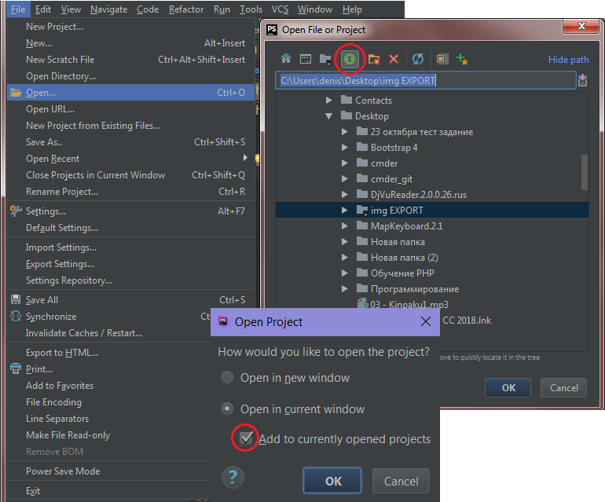

# PhpStorm (редактор кода от JetBrains)

---
## Полезные сочетания клавиш

* Ctrl + Shift + U -> Перевод выделенного текста в Uppercase или LowerCase
* Ctrl + Alt + J -> Наложение шаблона на выделенный участок кода `<tag>SELECT</tag>`

---
## Пользовательские настройки

* Settings -> Editor -> General -> Appearance : "Show whitespaces"=true

* Settings -> Editor -> General : "Use soft wraps in editor"=True

* Settings -> Keymap -> MainMenu -> File -> Synchronize -> Button2 Click (обновление папки проекта на колесо мышки)

* Settings -> Editor -> CodeStyle -> HTML|CSS|SCSS -> Tabs and Indents : TabSize=2, Indent=2, ContinIndent=8

* Settings -> Editor -> File and Code Templates -> CreateTemplate : NAME=Sass, Extension=scss, ReformatAccordingToStyle=true, code=
```js
.${NAME} {

}
```

* Settings -> Editor -> File and Code Templates -> CreateTemplate : NAME=Pug, Extension=pug, ReformatAccordingToStyle=true, code=""

* Settings -> Editor -> LiveTemplates -> ZenCSS -> Add : Abbreviation=@#, Description=prop_comments, ReformatAccordingToStyle=true, TemplateText="/* Positioning: posit..." (добавление быстрой команды для комментариев в CSS)

* Settings -> Editor -> LiveTemplates -> ZenHtml -> Add : Abbreviation=viewport, Description=meta-viewport, ReformatAccordingToStyle=true, TemplateText=
```html
<meta name="viewport" content="width=device-width">
```

* Setting -> Editor -> LiveTemplates -> ZenHtml -> Change : Abbreviation=!; Change meta tag ***viewport***
```html
<meta name="viewport" content="width=device-width, initial-scale=1, viewport-fit=cover">
```

### Pug настройки

1. Устанавливаем плагин "Pug (ex-Jade)"
2. Создаем группу для Pug сниппетов : Settings -> Editor -> LiveTemplates -> + Template group -> Name=Pug
3. Заполняем сниппетами : Settings -> Editor -> LiveTemplates -> + Live Template

* Name="!" Desc="main template" vars : 
	1. ENV_LOCALE = ru
	2. IE = edge
	3. CHARSET = utf-8
	4. STYLESHEET = css/style.css
	5. TITLE = Document
```php
doctype
html(lang="$ENV_LOCALE$")
head
    meta(http-equiv="X-UA-Compatible" content="ie=$IE$")
    meta(charset="$CHARSET$")
    meta(name="viewport" content="width=device-width")
    link(rel="stylesheet" href="$STYLESHEET$")
    title $TITLE$
body
  $END$
```
---
* Name="atr" Desc="tag with attribute" vars :
	1. tag 
	2. atr = id
	3. val 
```php
$tag$($atr$="$val$") $END$
```
---
* Name="cl" Desc="tag with class" vars :
	1. tag 
	2. class
	3. atr 
	4. val 
```php
$tag$.$class$($atr$="$val$") $END$
```
---
* Name="a" vars :
	1. class
	2. link
```php
a.$class$(href="$link$") $END$
```
---
* Name="form" vars :
	1. class
	2. action
	3. method
```php
form.$class$(action="$action$" method="$method$") $END$
```
---
* Name="img" vars :
	1. class
	2. src
	3. alt
```php
img.$class$(src="$src$" alt="$alt$") $END$
```
---
* Name="input" vars :
	1. class
	2. type
	3. name
	4. value 
```php
input.$class$(type="$type$" name="$name$" value="$val$")
```
---
* Name="link" vars :
	1. rel = stylesheet
	2. href
```php
link(rel="$rel$" href="$END$")
```
---
* Name="script" vars :
	1. src
```php
script(src="$END$")
```


---
## Список дополнительных плагинов

* EditorConfig
* FavoriteFolders
* Pug (ex-Jade)

---
## Полезные плагины

* [FavoriteFolders](https://plugins.jetbrains.com/plugin/5940-favoritefolders) - Добавляет избранные папки в FileChooser окно
Настройка :

